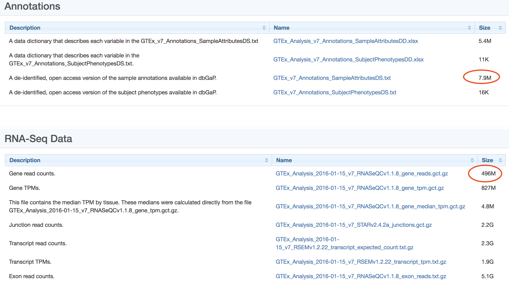
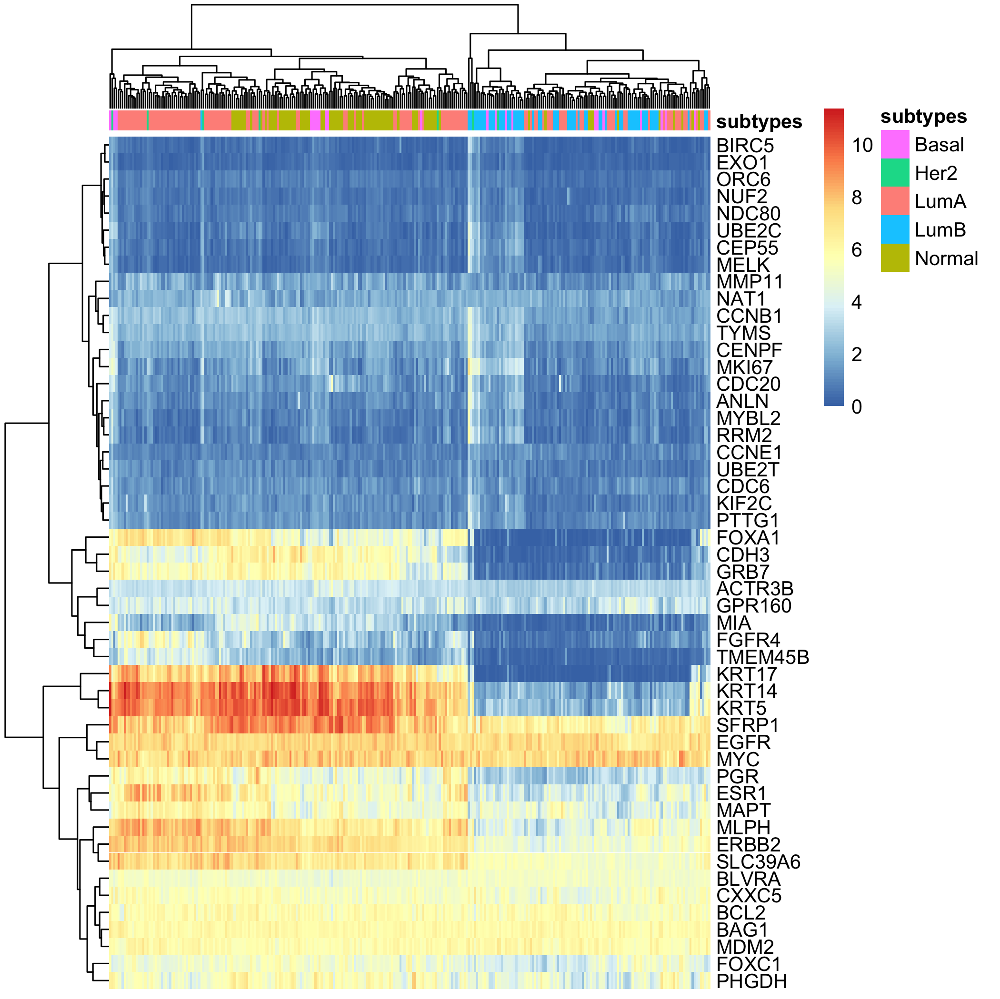
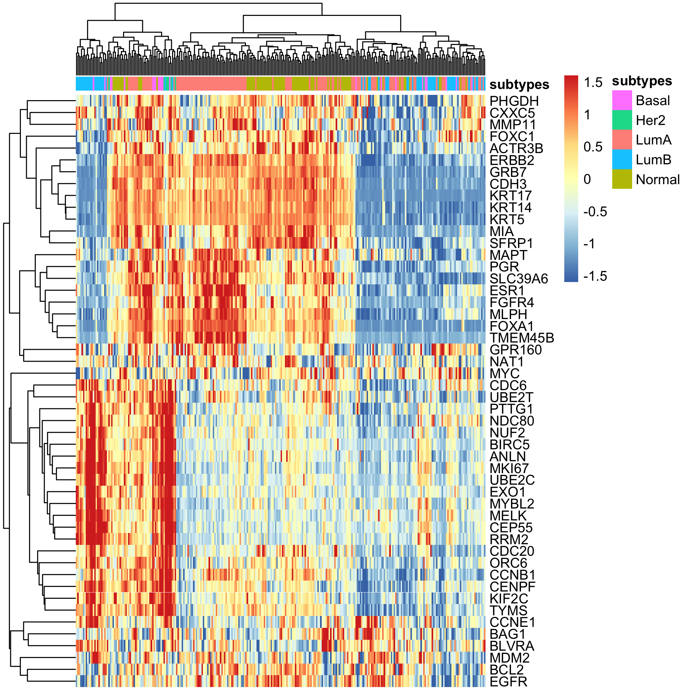

# gtex_BRCA

GTEx，The Genotype-Tissue Expression (GTEx) project，首次被提出来是**2013年**，上百位科学家联名在**Nature Genetics**杂志发表的文章首次介绍了“**基因型-组织表达工程**”，并成立了“基因型-组织表达研究联盟”（Genotype-Tissue Expression Consortium，GTEx）以下简称“GTEx”）。

已经发表的相关文献见：https://gtexportal.org/home/publicationPage 除了上面在science和nature大量发paper外，还在一下nature子刊发了不少。

这些数据还有着非常大的挖掘价值，希望大家踊跃思考！

### 首先从GTEX数据库下载表达矩阵文件

这个文件有点大，注意网速。

```
GTEx_Analysis_2016-01-15_v7_RNASeQCv1.1.8_gene_reads.gct.gz
```

如下所示：



### 然后把表达矩阵文件读入R

代码是：

```r
options(stringsAsFactors = F)
GTEx=read.table('~/Downloads/GTEx_Analysis_2016-01-15_v7_RNASeQCv1.1.8_gene_reads.gct.gz'
             ,header = T,sep = '\t',skip = 2)
GTEx[1:4,1:4]
h=head(GTEx)
save(h,file = 'GTEx_head.Rdata')
save(GTEx,file = 'GTEx_all.Rdata')
```


### 接着下载样本信息文件

在 [GTEx_v7_Annotations_SampleAttributesDS.txt](./GTEx_v7_Annotations_SampleAttributesDS.txt)


### 就可以根据样本信息从表达矩阵里面提取breast组织的样本

```r
load('~/Desktop/GTEx_all.Rdata')
  a[1:4,1:4]
  colnames(a)
  # SMTS	Tissue Type, area from which the tissue sample was taken.   
  # SMTSD	Tissue Type, more specific detail of tissue type
  b=read.table('GTEx_v7_Annotations_SampleAttributesDS.txt',
               header = T,sep = '\t',quote = '')
  table(b$SMTS) 
  breat_gtex=a[,gsub('[.]','-',colnames(a)) %in% b[b$SMTS=='Breast',1]]
  rownames(breat_gtex)=a[,1]
  dat=breat_gtex
  ids=a[,1:2]
  head(ids)
  colnames(ids)=c('probe_id','symbol')
  dat=dat[ids$probe_id,]
  dat[1:4,1:4] 
  ids$median=apply(dat,1,median)
  ids=ids[order(ids$symbol,ids$median,decreasing = T),]
  ids=ids[!duplicated(ids$symbol),]
  dat=dat[ids$probe_id,]
  rownames(dat)=ids$symbol
  dat[1:4,1:4]  
  breat_gtex=dat
  save(breat_gtex,file = 'breat_gtex_counts.Rdata')
```

### 对 breast的表达矩阵就可以走PAM50的分类

理论上PAM50是针对乳腺癌患者的表达矩阵，这里仅仅是运行代码：

```r
load(file = 'breat_gtex_counts.Rdata')
dat=log2(edgeR::cpm(breat_gtex)+1)
dat[1:4,1:4]
if(T){
  ddata=t(dat)
  ddata[1:4,1:4]
  s=colnames(ddata);head(s)
  library(org.Hs.eg.db)
  s2g=toTable(org.Hs.egSYMBOL)
  g=s2g[match(s,s2g$symbol),1];head(g)
  #  probe Gene.symbol Gene.ID
  dannot=data.frame(probe=s,
                    "Gene.Symbol" =s, 
                    "EntrezGene.ID"=g)
  ddata=ddata[,!is.na(dannot$EntrezGene.ID)]
  dannot=dannot[!is.na(dannot$EntrezGene.ID),] 
  head(dannot)
  library(genefu)
  # c("scmgene", "scmod1", "scmod2","pam50", "ssp2006", "ssp2003", "intClust", "AIMS","claudinLow")
  
  s<-molecular.subtyping(sbt.model = "pam50",data=ddata,
                         annot=dannot,do.mapping=TRUE)
  table(s$subtype)
  tmp=as.data.frame(s$subtype)
  subtypes=as.character(s$subtype)
}

library(genefu)
pam50genes=pam50$centroids.map[c(1,3)]
pam50genes[pam50genes$probe=='CDCA1',1]='NUF2'
pam50genes[pam50genes$probe=='KNTC2',1]='NDC80'
pam50genes[pam50genes$probe=='ORC6L',1]='ORC6'
x=dat
x=x[pam50genes$probe[pam50genes$probe %in% rownames(x)] ,]
tmp=data.frame(subtypes=subtypes)
rownames(tmp)=colnames(x)
library(pheatmap)


pheatmap(x,show_rownames = T,show_colnames = F,
         annotation_col = tmp,
         filename = 'ht_by_pam50_raw.png') 


x=t(scale(t(x)))
x[x>1.6]=1.6
x[x< -1.6]= -1.6

pheatmap(x,show_rownames = T,show_colnames = F,
         annotation_col = tmp,
         filename = 'ht_by_pam50_scale.png') 

```

### 出图如下：

首先是原始表达量的热图：




上面的图没办法得知感兴趣基因在不同样本的表达量高低，所以需要归一化：



### 更多分析

相信经过这个简单的教程，你对GTEX数据库应该是有所了解了，而且也很容易把数据拿到，利用到自己的课题里面。

如果需要更深入的分析，欢迎发邮件咨询我哈。